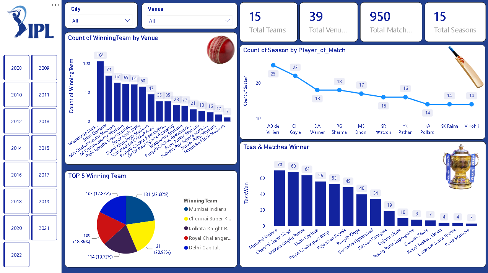

 # 🏏 IPL Matches Dashboard – Power BI

 
## 📌 Project Overview

 
This project presents an interactive IPL Matches Dashboard created using Microsoft Power BI. The dashboard helps analyze IPL match performance, team wins, toss results, player performance, cities, venues, seasons, and playoff matches.

## 🎯 Project Objective

 
The main objective of this project is to analyze IPL match data and create an interactive dashboard that provides meaningful insights into team performance, match trends, toss outcomes, player performance, and venue-wise analysis.

## 🛠️ Tools & Technologies

 
- Microsoft Power BI
- Power Query
- DAX
- Data Analysis
- Data Visualization
- CSV Dataset

## 📊 Dashboard Highlights

 
- Total Matches analysis
- Total Teams analysis
- Total Venues analysis
- Total Seasons analysis
- Team-wise Winning Analysis
- Toss Winner vs Match Winner
- Player of the Match Analysis
- City-wise Match Analysis
- Venue-wise Match Analysis
- Season-wise Match Analysis
- Playoff Match Analysis
- Interactive filters and slicers

## 🎛️ Interactive Filters

 
- City
- Venue
- Season

These filters allow users to interact with the dashboard and analyze the data based on different selections.

## 🏆 Team Winning Analysis

 
The dashboard provides team-wise winning analysis to compare the performance of different IPL teams and identify teams with higher numbers of match wins.

## 🪙 Toss Winner vs Match Winner

 
This analysis compares the toss-winning team with the match-winning team to understand how often the team winning the toss also won the match.

## ⭐ Player of the Match Analysis

 
The dashboard analyzes Player of the Match awards to identify players who received the most awards across the IPL matches.

## 🏟️ City & Venue Analysis

 
The dashboard provides city-wise and venue-wise analysis to understand where IPL matches were hosted and which locations hosted more matches.


## 🖼️ Dashboard Preview

 


## 📂 Project Files

 
- `PowerBI/IPL_Matches_Dashboard.pbix` – Power BI Dashboard
- `Dataset/New_iplData.csv` – Dataset used for analysis
- `Screenshots/IPL_Matches-Dashboard.png` – Dashboard Preview

## 💡 Key Insights

 
The dashboard provides a clear overview of IPL match data and helps identify team performance, winning trends, toss outcomes, top-performing players, high-match cities and venues, and season-wise match trends.

## 📐 DAX Measures

 
### Total Matches

```DAX
Total Matches =
COUNTROWS('IPL Matches')
````

### Total Teams

```DAX
Total Teams =
COUNTROWS(
    DISTINCT(
        UNION(
            SELECTCOLUMNS('IPL Matches', "Team", 'IPL Matches'[Team1]),
            SELECTCOLUMNS('IPL Matches', "Team", 'IPL Matches'[Team2])
        )
    )
)
```

### Total Venues

```DAX
Total Venues =
DISTINCTCOUNT('IPL Matches'[Venue])
```

### Total Seasons

```DAX
Total Seasons =
DISTINCTCOUNT('IPL Matches'[Season])
```

## 📁 Project Structure

 
```text
IPL-Matches-PowerBI-Dashboard/
│
├── README.md
│
├── Dataset/
│   └── New_iplData.csv
│
├── PowerBI/
│   └── IPL_Matches_Dashboard.pbix
│
└── Screenshots/
    └── IPL_Matches-Dashboard.png
```

## 👨‍💻 Author

 
**Darshan Bagthariya**

MCA Student | Aspiring Data Analyst
